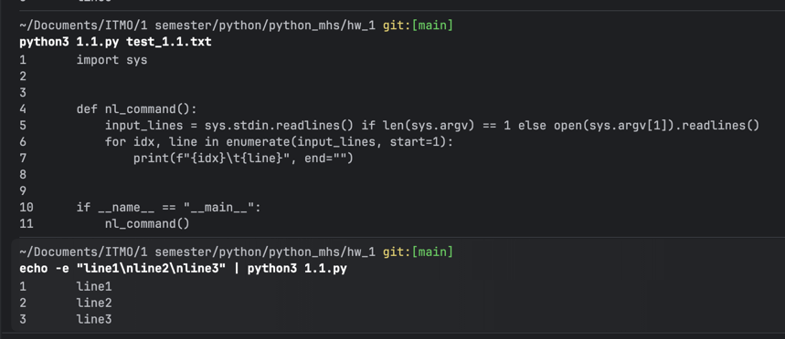

# Кейс 1

### Команда
```bash
#~/Documents/ITMO/1 semester/python/python_mhs/hw_1 git:[main]
python3 1.1.py test_1.1.txt
```
### Результат
```
1       import sys
2
3
4       def nl_command():
5           input_lines = sys.stdin.readlines() if len(sys.argv) == 1 else open(sys.argv[1]).readlines()
6           for idx, line in enumerate(input_lines, start=1):
7               print(f"{idx}\t{line}", end="")
8
9
10      if __name__ == "__main__":
11          nl_command()
```

# Кейс 2

### Команда
```bash
# ~/Documents/ITMO/1 semester/python/python_mhs/hw_1 git:[main]
echo -e "line1\nline2\nline3" | python3 1.1.py
```
### Результат
``` 
1       line1
2       line2
3       line3
```

