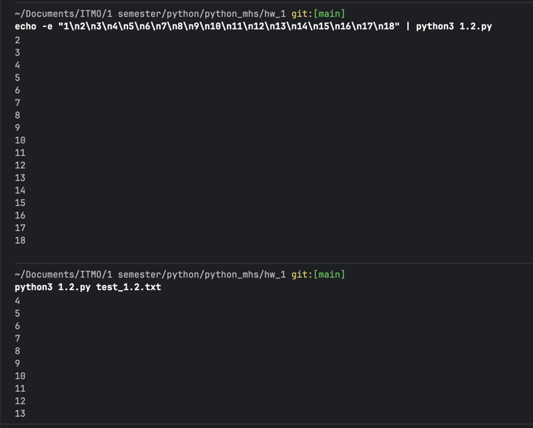
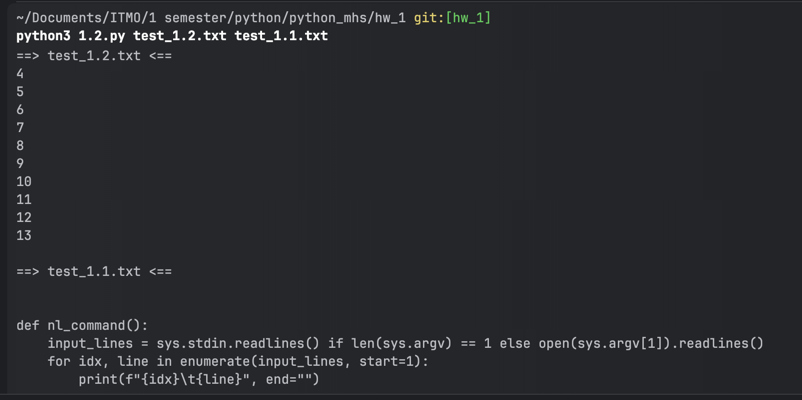

# Кейс 1

### Команда
```bash
# ~/Documents/ITMO/1 semester/python/python_mhs/hw_1 git:[main]
python3 1.2.py test_1.2.txt
```

### Результат
```
4
5
6
7
8
9
10
11
12
13
```

# Кейс 2

### Команда
```bash
# ~/Documents/ITMO/1 semester/python/python_mhs/hw_1 git:[main]
python3 1.2.py test_1.2.txt
```

### Результат
```
4
5
6
7
8
9
10
11
12
13
```

# Кейс 3

# Команда
```bash
# ~/Documents/ITMO/1 semester/python/python_mhs/hw_1 git:[hw_1]
python3 1.2.py test_1.2.txt test_1.1.txt
```

# Результат
```
==> test_1.2.txt <==
4
5
6
7
8
9
10
11
12
13

==> test_1.1.txt <==


def nl_command():
    input_lines = sys.stdin.readlines() if len(sys.argv) == 1 else open(sys.argv[1]).readlines()
    for idx, line in enumerate(input_lines, start=1):
        print(f"{idx}\t{line}", end="")


if __name__ == "__main__":
    nl_command()
```


