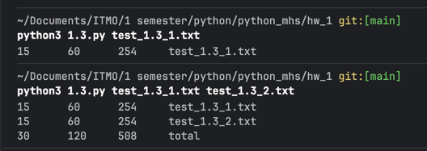

# Кейс 1

### Команда
```bash
# ~/Documents/ITMO/1 semester/python/python_mhs/hw_1 git:[main]
python3 1.3.py test_1.3_1.txt
```

### Результаты
```
15      60      254     test_1.3_1.txt
```

# Кейс 2

### Команда
```bash
# ~/Documents/ITMO/1 semester/python/python_mhs/hw_1 git:[main]
python3 1.3.py test_1.3_1.txt test_1.3_2.txt
```

### Результаты
```
15      60      254     test_1.3_1.txt
15      60      254     test_1.3_2.txt
30      120     508     total
```

